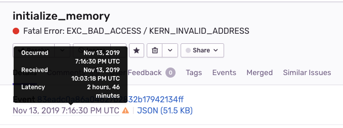

# sentry-native
## Setup
1. `git clone --recurse-submodules git@github.com:sentry-demos/sentry-native.git`
2. install `sentry-cli 1.49.0z` from https://github.com/getsentry/sentry-cli/releases/ and https://docs.sentry.io/cli/installation/. You can run `yarn global add @sentry/cli`
3. [mac](#mac)

## Dev Tips

This project makes use of **sentry-native**, the Sentry SDK for Native Crash Reporting https://github.com/getsentry/sentry-native

This project makes use of **sentry-native** in its packaged release form. It is referenced as a submodule in this project but you will download it as a distribution .zip from getsentry/sentry-native when you're ready to use it

## Mac
1. `make bin/example`
2. `make setup_release`
3. `make run`
4. `make clean`

#### What's Happening
`make bin/example` creates debug symbols and executables  
`make setup_release` creates a Sentry Release and associates git commits  
`make run` executes `src/example.c` which sends 2 Events to Sentry. 1 is for a native crash and the other is a Sentry Capture Message. First it removes any outstanding .dmp files from ./sentry-db  
`make clean` only needs to be run if you're trying to re-run `make bin/example`

## Windows
[*These instructions are still under development*](./windows.txt)

## Event Examples
[Symbolicated stacktrace of a native crash](screenshots/native-crash-stacktrace.png)

[Sentry capture message](screenshots/message-capture.png)

## Notes
Use https://github.com/getsentry/sentry-native when ready to implement this in your real code. this `sentry-demos/sentry-native` is an example implementation (demo) of `getsentry/sentry-native`

This project is not for developing or testing locally, so if the standalone distribution package doesn't fit your needs, then go to https://github.com/getsentry/sentry-native#development

You need to always run `bin/example` before `setup_release`

The [memset](http://www.cplusplus.com/reference/cstring/memset/) invocation in `src/example.c` is what causes a native crash

sentry-native in the news https://blog.sentry.io/2019/09/26/fixing-native-apps-with-sentry

## Gif


# Minidumps

You can `curl` your .dmp files directly to the Sentry API.

[Additional documentation - docs.sentry.io native/minidumps](https://docs.sentry.io/platforms/native/minidump/#minidump-additional)

## Setup
First you need to obtain your own Minidumps Endpoint for your Sentry Project
1. Project Settings > DSN Keys, click 'Expand' > Minidump Endpoint is given
2. You will use this api endpoint as the basis for your curl command in the next steps
```
curl -X POST \
  <your_minidump_endpoint> \
```
3. Produce your .dmp's by running a Mac [sentry-native](#sentry-native) crash. They will get stored in `./sentry-db/completed`
```
-F upload_file_minidump=@<name_of_your_file>.dmp
```

## Run
1. `cd ./sentry-db/completed`
2. 
```
curl -X POST \
  'https://sentry.io/api/1720457/minidump/?sentry_key=b5ceabee4e4a4cd6b21afe3bd2cbbed4' \
  -F upload_file_minidump=@b066e1b0-68ef-4d7a-8f59-e59ad0e63d8d.dmp
```
3. try with JSON for release + tags
```
curl -X POST \
  'https://sentry.io/api/1720457/minidump/?sentry_key=b5ceabee4e4a4cd6b21afe3bd2cbbed4' \
  -F upload_file_minidump=@40467503-6652-4dd5-8c7b-d63c7e29a649.dmp \
  -F 'sentry={"release":"1.2.3","tags":{"myotag":"value"}}'
```
4. try with Line-separated ("flattened") for release + tags

#### What Native Crash Looks Like?
- the 'myotag' tag appeared under heatmap, but not under TAGS section
- 'release' appeared on rt-side sidebar and heatmap, but not under TAGS section <-- could be a general upload problem
- the 'histag' did same, but 'myotag' is still there?

#### What Capture Message Looks Like?
It is a .dmp sent with the Capture Message? Does Capture Message return an exit status to the C/C++ function?
- no tag and no release shown

#### This curl dmp is producing 1 or 2?
Looks like it's producing 2, interesting.

#### We did for 'release' and 'tags' - try for other things?
- breadcrumbs (a lot of work, formatting-wise), etc.
- are release+tags sufficient for the time being? that's what our documentation covers

#### Note
- mention that you can do it with your own .dmp? any .dmp will work?
- Event time and Processing time may differ, depending on how long you wait between generating the event (native crash) and curl'ing it to sentry.io/api.

