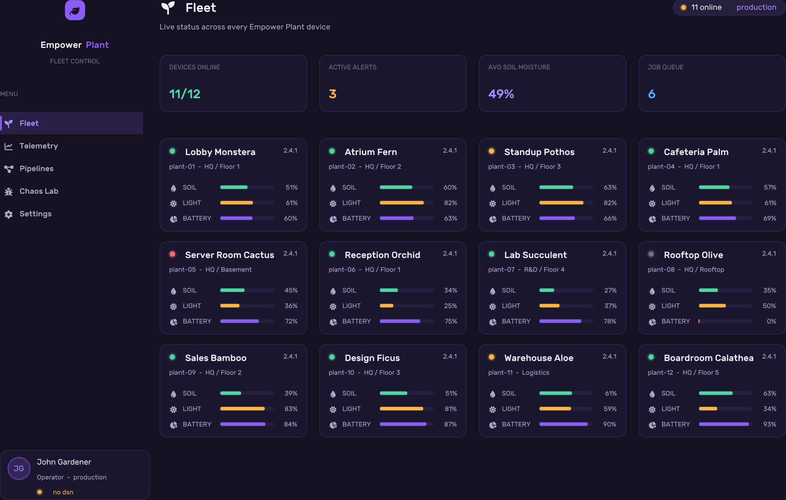
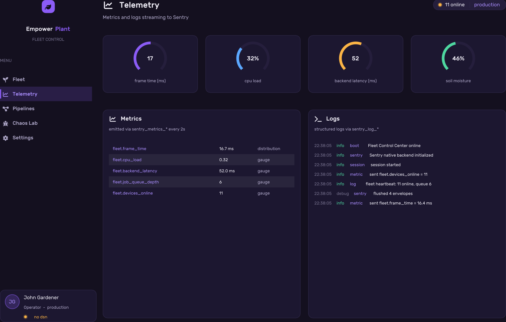
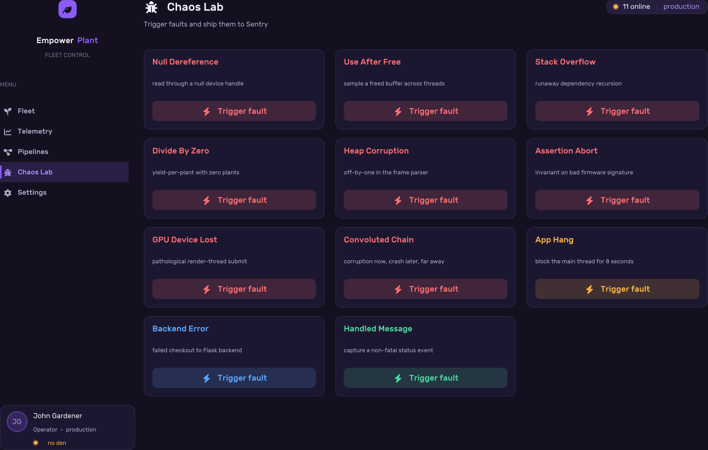

# Empower Plant — Fleet Control Center

A modern, cross-platform demo for **[sentry-native](https://github.com/getsentry/sentry-native)**, the Sentry SDK for native (C/C++) applications.

It is a desktop control center for a fictional fleet of Empower Plant IoT devices: a GPU-rendered dashboard with live telemetry, background pipelines, a real backend integration, and a **Chaos Lab** that triggers a curated taxonomy of crashes, hangs and errors — each instrumented with breadcrumbs, spans, tags, contexts and attachments so the resulting Sentry issue is fully debuggable (and a great showcase for Seer's root-cause analysis).

It runs on **Linux, macOS and Windows** and uses the new out-of-process **`native` crash backend** (no Breakpad, Crashpad or in-process handler).



## Quick start

### Prerequisites

All platforms need a **C++17 compiler**, **CMake ≥ 3.16**, and **Git**. Everything else — the Sentry SDK, GLFW, Dear ImGui, the Rubik and Font Awesome fonts, and stb — is fetched automatically by CMake on first configure (so the first build needs network access).

| OS | Install |
| --- | --- |
| **Linux** (Debian/Ubuntu) | `sudo apt-get install build-essential cmake git xorg-dev libgl1-mesa-dev libcurl4-openssl-dev` |
| **macOS** | `xcode-select --install` and `brew install cmake` (uses the system OpenGL and libcurl) |
| **Windows** | [Visual Studio 2022](https://visualstudio.microsoft.com/) with the *Desktop development with C++* workload, plus [CMake](https://cmake.org/download/) and Git. CMake's default generator finds MSVC — no extra setup. |

### Build & run

**Linux / macOS** — a convenience `Makefile` wraps CMake:

```sh
export SENTRY_DSN="https://<key>@<org>.ingest.sentry.io/<project>"
make run            # builds, then launches the GUI
```

Or drive CMake directly:

```sh
cmake -B build -S . -DCMAKE_BUILD_TYPE=RelWithDebInfo -DEMPOWER_BUILD_GUI=ON
cmake --build build --parallel
./build/empower-fleet
```

**Windows** (Developer Command Prompt or PowerShell):

```bat
cmake -B build -S . -DCMAKE_BUILD_TYPE=RelWithDebInfo -DEMPOWER_BUILD_GUI=ON
cmake --build build --config RelWithDebInfo --parallel
set SENTRY_DSN=https://<key>@<org>.ingest.sentry.io/<project>
build\empower-fleet.exe
```

Without a `SENTRY_DSN` the app still runs, but events are dropped instead of being sent. Open the **Chaos Lab** tab and trigger any fault — the `Convoluted Chain` is the headline scenario for Seer.

The build produces three binaries (each with the `sentry-crash` daemon copied next to it):

- `empower-fleet` — the GUI Fleet Control Center
- `empower-headless` — headless autopilot / remote command listener (used by CI)
- `empower-smoke` — a connectivity smoke test

> On macOS the binaries are ad-hoc codesigned at build time with the `get-task-allow` entitlement ([cmake/get-task-allow.entitlements](cmake/get-task-allow.entitlements)) so the crash daemon can capture **full** minidumps.

## What it demonstrates

| Area | Detail |
| --- | --- |
| **Crash reporting** | New `native` backend with out-of-process minidump daemon + client-side stackwalk, async upload |
| **Crash taxonomy** | Null deref, use-after-free (cross-thread), stack overflow, divide-by-zero, heap corruption, abort, GPU device-lost, app-hang, and a **convoluted chain** (corruption now, crash later, far away) |
| **Performance** | Transactions and child spans around pipelines and backend calls |
| **Distributed tracing** | `sentry-trace` / `baggage` propagation to the shared Empower Plant Flask backend |
| **Structured logs** | `sentry_log_*`, streamed live on the Telemetry page |
| **Metrics** | `sentry_metrics_gauge` / `_distribution` for frame time, queue depth, devices online |
| **Sessions / release health** | Automatic session tracking |
| **App-hang / ANR** | App-hang watchdog with a UI-thread heartbeat |
| **Attachments** | Calibration blobs and a **live UI screenshot** attached to events on every platform |
| **Screenshots** | SDK screenshot capture on Windows; offscreen-rendered UI PNG attachment elsewhere |
| **External crash reporter** | Auto-wires the official [sentry-desktop-crash-reporter](https://github.com/getsentry/sentry-desktop-crash-reporter), themed for Empower Plant |
| **User feedback** | Collected through the external crash reporter |
| **Before-send hooks** | `before_send`, `before_send_log`, `before_send_metric`, and `before_transaction` — SDK callbacks invoked on each payload before upload; return the value to send (optionally modified) or `null` to drop it client-side for PII scrubbing, enrichment, or filtering logs, metrics, and transactions |
| **Offline caching** | `SENTRY_CACHE_KEEP_ALWAYS` + Settings **Go Offline** toggle; soft events queue under `.sentry-native/cache/` and drain when back online |

| Telemetry | Chaos Lab |
| --- | --- |
|  |  |

## Configuration (environment variables)

| Variable | Default | Purpose |
| --- | --- | --- |
| `SENTRY_DSN` | — | Sentry DSN; events are dropped if unset |
| `SENTRY_ENVIRONMENT` | `production` | Sentry environment |
| `SENTRY_RELEASE` | baked in at build time (`empower.native@<git-sha>`) | Release identifier; matches the release CI creates |
| `EMPOWER_BACKEND_URL` | `https://flask.empower-plant.com` | Backend used for distributed tracing |
| `EMPOWER_CRASH_REPORTER` | auto-detected next to the binary | Path to the external crash reporter |
| `EMPOWER_DEBUG` | unset | Set to enable verbose SDK logging |

## Headless & remote control

The same core runs without a window — used by CI to ingest events on a schedule.

```sh
# Self-drive for 90s emitting transactions/metrics/logs, then crash:
build/empower-headless --autopilot --duration 90

# Run a single scenario by id:
build/empower-headless --crash convoluted

# Accept remote commands over HTTP:
build/empower-headless --listen 8799
curl -X POST http://127.0.0.1:8799/trigger/heap-corruption
```

The GUI also renders a screenshot offscreen for review/CI without a display:

```sh
build/empower-fleet --shot fleet.png --page 0
```

## CI

Two GitHub Actions workflows under [.github/workflows](.github/workflows):

- **`ci.yml`** builds on Linux/macOS/Windows, generates debug symbols (`.dSYM` / `.pdb` / ELF), uploads debug information files with `sentry-cli debug-files upload --include-sources`, creates a Sentry release, bundles the external crash reporter, and publishes build artifacts.
- **`run-demo.yml`** runs on a schedule, downloads the latest build per OS, and runs the autopilot (which is expected to crash), continuously feeding meaningful, symbolicated events into the project.

Both require the `SENTRY_DSN`, `SENTRY_ORG`, `SENTRY_PROJECT` and `SENTRY_AUTH_TOKEN` secrets.

## The crash taxonomy

Every Chaos Lab scenario and the exact fault it produces is documented in [CONTRIBUTING.md](CONTRIBUTING.md).

## Open source

This demo is built on the following open-source components, all fetched at build time (nothing is vendored into the repository). Their licenses are permissive and compatible with this project's Apache-2.0 license:

| Component | Used for | License |
| --- | --- | --- |
| [sentry-native](https://github.com/getsentry/sentry-native) | Sentry SDK + native crash backend | MIT |
| [Dear ImGui](https://github.com/ocornut/imgui) | Immediate-mode GUI | MIT |
| [GLFW](https://github.com/glfw/glfw) | Window + OpenGL context | Zlib |
| [stb_image_write](https://github.com/nothings/stb) | PNG screenshot encoding | Public Domain / MIT |
| [libcurl](https://curl.se/libcurl/) | HTTP for distributed-trace backend calls | curl (MIT-style) |
| [Rubik](https://github.com/googlefonts/rubik) | UI typeface | SIL Open Font License 1.1 |
| [Font Awesome 6 Free](https://github.com/FortAwesome/Font-Awesome) | UI icons | SIL OFL 1.1 (fonts) · CC BY 4.0 (icons) · MIT (code) |
| [sentry-desktop-crash-reporter](https://github.com/getsentry/sentry-desktop-crash-reporter) | External crash reporter UI | MIT |

## License

Apache License 2.0 — see [LICENSE](LICENSE). Copyright Functional Software, Inc. dba Sentry.
